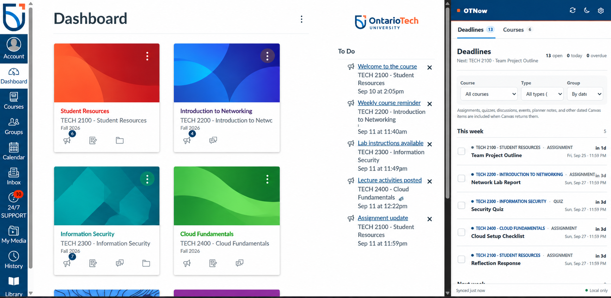

# OTNow

OTNow is an unofficial Chrome extension for Ontario Tech students who use Canvas. It puts dated coursework in a persistent side panel, notices when due dates move, and sends configurable reminders without asking for a Canvas password or sending course data to a separate server.

The project name is **OTNow**.



## Install OTNow from GitHub

OTNow is being prepared for the Chrome Web Store. Until its listing is approved, use the packaged release rather than GitHub's source-code download.

> [!IMPORTANT]
> Open the [latest OTNow release](https://github.com/sil6428/OTNow/releases/latest) and download the file named `otnow-VERSION.zip` under **Assets**. Do **not** use the green **Code > Download ZIP** button. GitHub's source ZIP adds an extra repository folder and can cause Chrome's “manifest file is missing or unreadable” error when the wrong folder is selected.

1. Download `otnow-VERSION.zip` from the [latest release](https://github.com/sil6428/OTNow/releases/latest).
2. Right-click the downloaded ZIP and choose **Extract All**.
3. Open the extracted folder and confirm that `manifest.json` is visible beside the `icons`, `options`, `panel`, and `src` folders.
4. In Chrome, open `chrome://extensions`.
5. Turn on **Developer mode**.
6. Select **Load unpacked** and choose the exact folder that directly contains `manifest.json`.
7. Pin **OTNow**, open Ontario Tech Canvas, and click the OTNow toolbar icon.

If Chrome reports that it cannot read the manifest, the selected folder is one level too high. Open the folder inside it and select the folder where `manifest.json` is directly visible.

## Current feature set

- Reads the current student's active courses and Canvas planner items.
- Groups dated work by **type** or by **due-date range**.
- Filters by course and item type, including assignments, quizzes, discussions, events, planner notes, and other dated Canvas items.
- Provides a Courses directory with direct links to each course's home, modules, assignments, quizzes, discussions, files, and grades.
- Detects assignments Canvas reports as submitted or graded.
- Lets a student locally check off other items without changing Canvas.
- Highlights a moved due date for seven days and can notify the student.
- Supports per-type reminder timing for assignments, quizzes, discussions, events, and planner notes.
- Allows reminder notifications to be muted for individual courses without hiding their deadlines.
- Keeps the last successful read available when Canvas or the network is unavailable.
- Supports light, dark, or system appearance.
- GitHub-installed copies check the public OTNow repository for a newer version and link to [step-by-step update instructions](UPDATE_GUIDE.md); Chrome Web Store copies update automatically.
- Refreshes every 30 minutes while Chrome is running.

## Privacy and security model

- The extension uses the existing browser session at `https://learn.ontariotechu.ca`.
- It never requests, receives, or stores the student's password.
- The Canvas bridge permits only two read-only endpoints:
  - `GET /api/v1/courses`
  - `GET /api/v1/planner/items`
- GitHub-installed copies read only OTNow's public `manifest.json` about every six hours and send no student or course information; the Chrome Web Store build disables this request because Chrome supplies automatic updates.
- All course data, settings, manual check-offs, and reminder history live in `chrome.storage.local` on the student's computer.
- There is no telemetry, analytics SDK, ad code, external API, or OTNow account.
- OTNow is not affiliated with or endorsed by Ontario Tech University or Instructure.

See [PRIVACY.md](PRIVACY.md) for a publishable privacy policy.

If Canvas was already open before installing OTNow, reload that Canvas tab once. Future versions can be installed without removing OTNow; follow [UPDATE_GUIDE.md](UPDATE_GUIDE.md) so local settings remain attached to the same unpacked extension folder.

## Chrome Web Store status

The extension package, listing copy, permission justifications, privacy policy, and sanitized screenshots are prepared. The remaining external steps are registering a Chrome Web Store developer account, paying Google's one-time registration fee, uploading the ZIP, completing the dashboard disclosures, and submitting the listing for Google's review. See [the store submission guide](docs/CHROME_WEB_STORE_SUBMISSION.md).

## Development

OTNow has no build step and no runtime dependencies. Its source is the extension package.

```text
manifest.json             Chrome Manifest V3 configuration
src/background.js        Sync, reminders, moved dates, badges, and messages
src/canvas-client.js      Allowlisted Canvas reads and pagination
src/content/              Same-origin Canvas session bridge
src/canvas-model.js       Data normalization and due-date reconciliation
panel/                    Side-panel interface
options/                  Reminder, appearance, and privacy settings
tests/                    Node unit tests for pure application logic
```

Run the local checks with a recent Node.js version:

```bash
npm test
npm run check
```

Create the clean Chrome Web Store ZIP on Windows:

```powershell
npm run package:store
```

Create the GitHub release ZIP with the manual update guide using `npm run package:release`.

## Live validation

The extension's installation, Ontario Tech Canvas session bridge, first course/deadline refresh, and side-panel rendering were validated against `learn.ontariotechu.ca` on September 24, 2026.

### Remaining release checks

The automated tests use representative Canvas response shapes. Before recommending OTNow for broad use, validate these cases with consenting Ontario Tech test users:

- SSO sign-in and sign-out
- a course nickname and a long course name
- assignment, quiz, discussion, calendar event, and planner note
- submitted, graded, missing, excused, and manually completed states
- due-date extension and shortened deadline
- more than 100 planner items (pagination)
- Chrome closed during a reminder time
- network offline and Canvas unavailable
- screen reader and keyboard-only navigation

## Sources and design references

- [Ontario Tech Canvas service page](https://itsc.ontariotechu.ca/services/canvas.php)
- [Ontario Tech official colour standards](https://brand.ontariotechu.ca/guidelines/brand-standards/colours-design-graphics-and-fonts/colours.php)
- [Canvas Planner API](https://developerdocs.instructure.com/services/canvas/resources/planner)
- [Canvas Courses API](https://developerdocs.instructure.com/services/canvas/resources/courses)
- [Chrome Side Panel API](https://developer.chrome.com/docs/extensions/reference/api/sidePanel)
- [WATnow](https://github.com/EricJujianZou/watnow), the MIT-licensed Waterloo deadline-panel project that inspired the product direction

## License

MIT. See [LICENSE](LICENSE) and [THIRD_PARTY_NOTICES.md](THIRD_PARTY_NOTICES.md).
