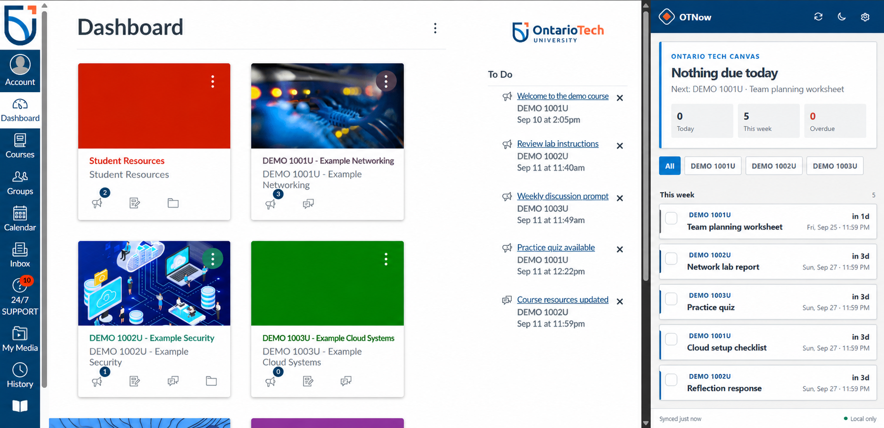

# OTNow

OTNow is an unofficial Chrome extension for Ontario Tech students who use Canvas. It puts dated coursework in a persistent side panel, notices when due dates move, and sends configurable reminders without asking for a Canvas password or sending course data to a separate server.

The project name is **OTNow**.



## Current feature set

- Reads the current student's active courses and Canvas planner items.
- Groups open work into **Overdue**, **Today**, **This week**, **Next week**, and **Later**.
- Detects assignments Canvas reports as submitted or graded.
- Lets a student locally check off other items without changing Canvas.
- Highlights a moved due date for seven days and can notify the student.
- Supports per-type reminder timing for assignments, quizzes, discussions, events, and planner notes.
- Allows reminder notifications to be muted for individual courses without hiding their deadlines.
- Keeps the last successful read available when Canvas or the network is unavailable.
- Filters the panel by course and supports light, dark, or system appearance.
- Refreshes every 30 minutes while Chrome is running.

## Privacy and security model

- The extension uses the existing browser session at `https://learn.ontariotechu.ca`.
- It never requests, receives, or stores the student's password.
- The Canvas bridge permits only two read-only endpoints:
  - `GET /api/v1/courses`
  - `GET /api/v1/planner/items`
- All course data, settings, manual check-offs, and reminder history live in `chrome.storage.local` on the student's computer.
- There is no telemetry, analytics SDK, ad code, external API, or OTNow account.
- OTNow is not affiliated with or endorsed by Ontario Tech University or Instructure.

See [PRIVACY.md](PRIVACY.md) for a publishable privacy policy.

## Install the development build

1. Open `https://learn.ontariotechu.ca` and sign in.
2. In Chrome, open `chrome://extensions`.
3. Turn on **Developer mode**.
4. Select **Load unpacked**.
5. Choose this repository's `projects/otnow-extension` folder.
6. Pin **OTNow**, click its toolbar icon, and allow the first refresh to finish.

If Canvas was already open before installing the extension, reload that Canvas tab once.

## Development

OTNow has no build step and no runtime dependencies. Its source is the extension package.

```text
manifest.json             Chrome Manifest V3 configuration
src/background.js        Sync, reminders, moved dates, badges, and messages
src/canvas-client.js      Allowlisted Canvas reads and pagination
src/content/              Same-origin Canvas session bridge
src/canvas-model.js       Data normalization and due-date reconciliation
panel/                    Side-panel interface
options/                  Reminder, appearance, and privacy settings
tests/                    Node unit tests for pure application logic
```

Run the local checks with a recent Node.js version:

```bash
npm test
npm run check
```

Create the clean Chrome Web Store ZIP on Windows:

```powershell
powershell -ExecutionPolicy Bypass -File scripts/package-release.ps1
```

## Live validation

The extension's installation, Ontario Tech Canvas session bridge, first course/deadline refresh, and side-panel rendering were validated against `learn.ontariotechu.ca` on September 24, 2026.

### Remaining release checks

The automated tests use representative Canvas response shapes. Before publishing, validate these cases with consenting Ontario Tech test users:

- SSO sign-in and sign-out
- a course nickname and a long course name
- assignment, quiz, discussion, calendar event, and planner note
- submitted, graded, missing, excused, and manually completed states
- due-date extension and shortened deadline
- more than 100 planner items (pagination)
- Chrome closed during a reminder time
- network offline and Canvas unavailable
- screen reader and keyboard-only navigation

## Sources and design references

- [Ontario Tech Canvas service page](https://itsc.ontariotechu.ca/services/canvas.php)
- [Ontario Tech official colour standards](https://brand.ontariotechu.ca/guidelines/brand-standards/colours-design-graphics-and-fonts/colours.php)
- [Canvas Planner API](https://developerdocs.instructure.com/services/canvas/resources/planner)
- [Canvas Courses API](https://developerdocs.instructure.com/services/canvas/resources/courses)
- [Chrome Side Panel API](https://developer.chrome.com/docs/extensions/reference/api/sidePanel)
- [WATnow](https://github.com/EricJujianZou/watnow), the MIT-licensed Waterloo deadline-panel project that inspired the product direction

## License

MIT. See [LICENSE](LICENSE) and [THIRD_PARTY_NOTICES.md](THIRD_PARTY_NOTICES.md).
